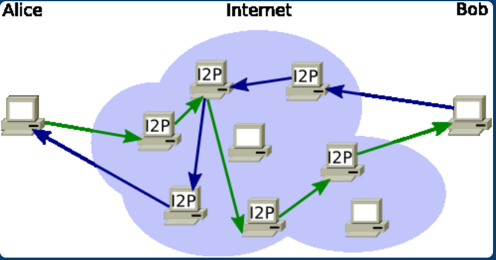

# Hidden Point Communication (HPC)

### Este é um projeto open-source com o objetivo de criar uma rede privada de comunicação, baseando em principios, tecnicas e práticas das redes I2P e Tor. 

## Versao 0.0.1
 

### A ideia é criar um sistema somente de envio e recebimento de mensagens, voltado inteiramente para a comunicação privada, a maneira abordada é uma prototipação de um sistema P2P, usando um servidor central de registros de nós, para que ocorra a comunicação dos mesmos.

## Uso de Servidores de Descoberta (DHT – Tabela de Hash Distribuída)
### Em redes P2P descentralizadas, como as usadas no BitTorrent, IPFS e I2P, os nós não precisam saber diretamente o IP de outro nó. Em vez disso, utilizam sistemas como DHT (Distributed Hash Table) para encontrar outros nós na rede.

<h2 align="center">Exemplos de redes P2P.</h2>

  
  

### Como funciona:

- #### Um nó (chamado de peer) pode se registrar em um servidor de descoberta ou tabela de hash distribuída.

- #### Ao entrar na rede, o nó coleta informações sobre outros nós (por exemplo, endereço IP e porta), armazenando essas informações em um índice distribuído.

- #### Quando você deseja se comunicar com outro nó, você consulta essa tabela distribuída (DHT) para encontrar os endereços IP dos nós disponíveis.

### Exemplos de sistemas que utilizam DHT:

- #### BitTorrent: Quando você baixa ou sobe arquivos, o protocolo DHT ajuda a encontrar outros peers que possuem os mesmos arquivos.

- #### IPFS: Armazenamento distribuído de arquivos.

- #### I2P: Rede privada descentralizada, como o Tor, mas para comunicação privada.

### Exemplo de como isso funcionaria na prática:

- #### Entrar na rede: Você começa conectando-se a um nó "servidor" que já tem informações sobre outros nós.

- #### Consulta de peers: Quando você quer se comunicar com outro nó, consulta o DHT ou outro nó de descoberta para encontrar o IP de destino.

- #### Conexão direta: Depois de obter o IP do nó desejado, você pode se conectar diretamente a ele.

## Problemas encontrados.
- ## Como encontrar outros nós?

    - #### Vamos supor que nao exista um servidor, ok, os próprios nós deveram ser os servidores, mas como eu vou saber o endereço do nó X que eu quero me comunicar? 

- ## Usabilidade.

    - #### A ideia era que pelo terminal o usuario conseguisse realizar todas as operações, exemplo: 
        - #### U para atualizar a lista de nós na rede (A tela seria limpa e todos os nós seriam listados).
        - #### X para fechar o sistema.
        - #### S para selecionar o nó especifico (Pode ter a opçao de escoler ou não mandar mensagem, e voltar para o menu).

- ## Privacidade.

- ### Transporte da mensagem.

    - #### Ainda na prototipação, a criação e utilização de um protocolo leve, rápido e seguro, como será somente de mensagens, baseando-se no protocolo TCP da camada de transporte, o protocolo poderia ser responsável por enviar os dados de uma única vez, mas, alterando a porta a cada envio, e antes de alterar a porta, o nó enviaria no protocolo o número da futura porta que será usada para a nova conexão. 
        - #### Problema: se ambos os nós mandarem mensagens simultâneamente? se ambos mudarem de porta, a mensagem é perdida
        - #### Solução: ter um atraso de 10 segundos antes de fechar a porta usada anteriormente.

- ### Criptografia da Mensagem.

    - #### Utilização de uma criptografia assimetrica. Se baseando na criptografia usado pelas rede I2P e Tor.

### Requisitos:
- #### Golang

### Como rodar:
- #### Ativar primeiramente o servidor:
        go run Server.py

- #### Ativar o cliente:
        go run Client.py

### Contribuições

Se você deseja contribuir para este projeto, fique à vontade para criar pull requests ou relatar issues. Melhorias como persistência de dados, maior segurança, e otimizações de desempenho são sempre bem-vindas.

## Autores
- [@Rodrigo_Kelven](https://github.com/Rodrigo-Kelven)
